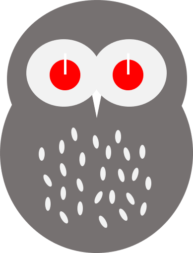

# Togowl

[](https://github.com/tadashi-aikawa/togowl/actions)
[](https://github.com/prettier/prettier)

A Google Chrome extension for Toggl and Owl! :owl:



## Configuration

### Prefix mapping YAML

```
event:
  start: ":emoji_start:"
  done: ":emoji_done:"
  pause: ":emoji_pause:"
  interrupt: ":emoji_interrup:"
  force_stop: ":emoji_force_stop:"
  delete: ":emoji_delete:"

client:
  "your_client1": ":emoji1:"
  "your_client2": ":emoji2:"

project:
  "your_project1": ":emoji1:"
  "your_project2": ":emoji2:"
```

## Development

```bash
npm i
```

```bash
npm run dev
```

## Build

```bash
npm run dev-build
```

TODO: Use `npm run build` instead of `npm run dev-build` if it works.

## Version up

1. `npm version ...`
2. Update version in `manifest.json`
